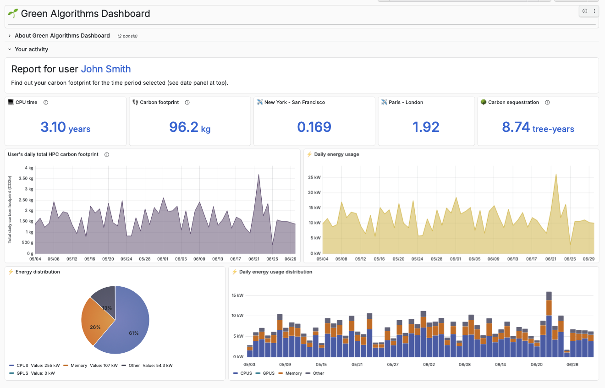
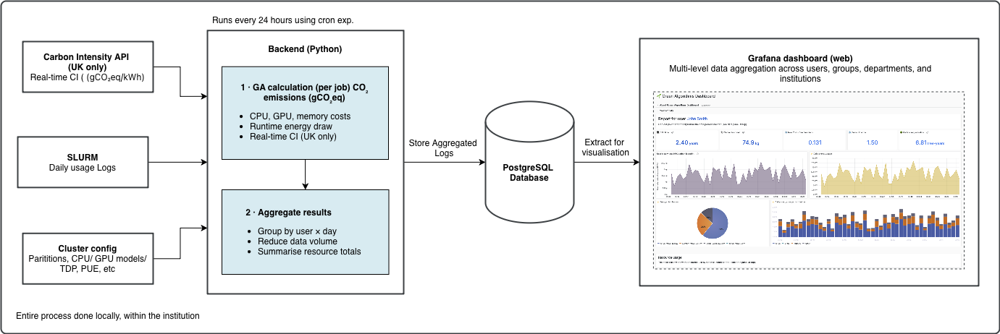

# Green Algorithms Dashboard 
-orange)
[](https://github.com/Naereen/badges/)

The Green Algorithms Dashboard helps to make visible the environmental impacts of high performance computing (HPC) workloads. By connecting to workload managers such as SLURM, the dashboard automatically captures job-level information and translates it into meaningful insights into energy use, carbon emissions, and more. Users can see how their work contributes to overall resource consumption and emissions, whether at the level of individual users or across teams and institutions.

An intuitive, interactive Grafana interface combines high-level summaries—including easy-to-digest, relatable equivalences of carbon emissions expressed in terms of flights, car travel, or tree sequestration—with detailed breakdowns of resource usage at individual, team and organisation level



> #### Try it out yourself!
> Check out our [demo website](https://dashboard.green-algorithms.org/) set up with mock data for visualising a running dashboard.
> 
> Make sure to set the date range between May 2023 - June 2023 to see the data.
>
> Log in details:
> - Username: uid_1 
> - Password: user1

### Key Features
- Open-source 
- Multi-level data aggregation across users, groups, departments, and institutions
- Cluster-informed emissions estimation built into the system
- Real-time carbon intensity via the Carbon Intensity API (for UK-based clusters only)
- Grafana-based dashboard with interactive visualisations and plots
- Visibility into carbon emissions from failed jobs
- Data processed and stored locally on the HPC system for privacy and control

### Who is it for?
The dashboard is intended for users of research computing infrastructure, including researchers running computational workloads. System administrators and research software engineers play a key role in installing, configuring, and maintaining the dashboard on HPC systems.

> Visit the [Green Algorithms](https://www.green-algorithms.org/dashboard/) website for a quick walkthrough of the tool.

---

# Deployment notes

The Green Algorithms HPC Dashboard is built using the [Green Algorithms](https://doi.org/10.1002/advs.202100707) methodology. The only data used are the SLURM logs of individual jobs. It combines a data collection backend, a PostgreSQL database, and a Grafana server that queries the database and visualises the results. The backend should be configured as a daily cron job to pull and process the previous day's logs, keeping the dashboard up to date.

By the end of this guide, you will have:

- A PostgreSQL database populated with your HPC usage data
- A running Grafana server with dashboards configured
- User accounts set up for your team

The system has three components:

1. Backend - queries the HPC scheduler (here `SLURM` via `sacct`), aggregates usage per user per day, and calculates estimated energy use and carbon footprint.
2. Database - a PostgreSQL database storing the processed usage data
3. Frontend - a Grafana server that queries the database and displays the data as interactive graphs and charts




### Contents
* [Prerequisites](#prerequisites)
  * [1. Python environment (Miniforge)](#1-python-environment-miniforge)
  * [2. Install python packages and dependencies](#2-install-python-packages-and-dependencies)
  * [3. PostgreSQL Database server](#3-postgresql-database-server)
  * [4. Grafana Dashboard Server](#4-grafana-dashboard-server)
* [Configuration files](#configuration-files)
  * [1. Scripts configuration file](#1-scripts-configuration-file-configyaml)
  * [2. Cluster information file](#2-cluster-information-file-cluster_infoyaml)
  * [3. Fixed parameters file](#3-fixed-parameters-file-fixed_parametersyaml)
  * [4. Dashboard users file](#4-dashboard-users-file-user_listcsv)
* [Install Green Algorithms dashboard](#install-green-algorithms-dashboard)
* [HPC usage data collection](#hpc-usage-data-collection)
  * [First run (historical data)](#first-run-historical-data)
  * [Scheduled runs](#scheduled-runs)
* [Green Algorithms dashboards](#green-algorithms-dashboards)
  * [Run Grafana server](#run-grafana-server)
  * [Logging in to Grafana](#logging-in-to-grafana)
* [Getting help](#getting-help)
* [Licence](#licence)


Files required to deploy the dashboard (you will need your own versions of these):

* [Scripts configuration file](#configuration-files): template `config.yaml` (in `configuration/templates/`) to copy and edit.
* [Cluster config file](#configuration-files): `cluster_info.yaml` (in `configuration/templates/`)
* [Dashboard users file](#list-of-users) `user_list.csv` (in `configuration/templates/`)


---
## Prerequisites

### 1. Python environment (Miniforge)

 First, set up a Python environment (Python 3.13+ recommended) using [Miniforge](https://conda-forge.org/download/) (recommended). Follow the instructions for your platform (see also the [Miniforge GitHub repository](https://github.com/conda-forge/miniforge) if needed).

Once installed, you can create an environment. For example:
```
$ conda create -n py313 python=3.13 -c conda-forge
$ conda activate py313
```
This environment is where you will install the `ga_dashboard` package and its dependencies in the next step.

For more information about `conda` and its [list of commands](https://docs.conda.io/projects/conda/en/latest/user-guide/cheatsheet.html), please go to the [conda documentation website](https://docs.conda.io/projects/conda/en/latest/user-guide/getting-started.html).


### 2. Install python packages and dependencies
Install the `ga_dashboard` python package and dependencies from `requirements.txt` in your conda environment.

1. Run the following command in the top-level directory of the `GA4HPCdashboard` directory (i.e. one level above the `ga_dashboard` directory):
    ```
    $ pip install -r requirements.txt
    ```
    or
    ```
    $ poetry install
    ```
    based on which tool (`pip` or `poetry`) you prefer to use.

2. Run either of the following commands to install the `ga_dashboard` software package:
    ```
    $ python -m pip install .
    ```
    (Note the period character at the end). This should install the `ga_dashboard` package on your local machine. If you want to be able to edit it and still use it, use the `-e` option:
    ```
    $ python -m pip install -e .
    ```
    This option is only needed if you intend to modify the package.

### 3. PostgreSQL Database server
Install PostgreSQL locally or have access to a PostgreSQL server.

It is assumed that the operating system used to run the dashboard will be a flavour of UNIX/Linux. However, if you want to run it on a Mac, we suggest you use the relevant [Enterprise DB installer](https://www.enterprisedb.com/downloads/postgres-postgresql-downloads) to start with. Regardless, follow the instructions for your system.

>[!NOTE]
> These instructions assume PostgreSQL is installed on the same machine as the dashboard and Grafana. If your setup requires PostgreSQL to be hosted on a separate server, you may need a version of PostgreSQL compiled with SSH support.

Choose a username and password for the PostgreSQL admin user (conventionally `postgres`). These instructions assume you use `postgres` as the admin username.

> [!IMPORTANT] 
> Do not store the admin password in a file. If you forget it, follow [these steps](https://stackoverflow.com/questions/14588212/postgresql-resetting-password-of-postgresql-on-ubuntu) to reset it.

> [!NOTE]
> Dashboard users should be granted only SELECT permission on the database.

Check that your `$PATH` allows you to access the `psql` utility.

### 4. Grafana

Install the [self-managed Grafana Enterprise edition](https://grafana.com/grafana/download?pg=get&plcmt=selfmanaged-box1-cta1) (Enterprise, just in case you want to host it on the cloud).

By default, the superuser credential is id: `admin`, password: `admin`. You should change the password to make your set-up more secure.


---
## Configuration files

Before running the dashboard, you will need to prepare three configuration files. Templates and examples for all of them are provided in the `configuration/templates/` and `configuration/examples/` directories respectively.

### 1. Scripts configuration file (`config.yaml`)
Copy the template provided in `configuration/templates/config.yaml` to a location of your choice and edit it, replacing all values surrounded by `< >` characters. This file contains the core parameters needed to run the dashboard, including database connection details and paths to the other configuration files. You can uncomment the optional parameters you want to use.

> [!NOTE]
> If you choose to run the dashboard inside a Docker container, note that restarting the container can cause the database to be deleted and re-created. To prevent this, set `skip_db_overwrite: True` in `config.yaml`.

#### Carbon intensity (CI)
The dashboard uses carbon intensity (CI) data to estimate the carbon footprint of your HPC usage. There are three ways to configure this:

1. **Carbon Intensity API (UK only)**
If your cluster is based in the UK, the dashboard can pull dynamic carbon intensity data from the [Carbon Intensity API](https://carbonintensity.org.uk). To enable this, add the first three characters of your **postcode** to `config.yaml`. The dashboard uses a daily average of the carbon intensity values returned by the API.
2. **Fixed carbon intensity value**
For clusters outside the UK, you can provide a fixed carbon intensity value directly in `config.yaml`, e.g. the average carbon intensity in the data centre's location (you can find it [here](https://app.electricitymaps.com)). This will be used for all calculations.
3. **Custom API integration**
If you would like to use a different carbon intensity API for your region, you can implement your own integration using the `APIService` class in `ga_dashboard/backend/services/api_service.py`. Get in touch if you need guidance on this.

### 2. Cluster information file (`cluster_info.yaml`)
Copy the template provided in `configuration/templates/cluster_info.yaml` and edit it with information about your HPC cluster. See `configuration/examples/cluster_info__demo.yaml` for a worked example.

For each partition (a set of computing nodes with a dedicated queue) you will need:
- `type`: CPU or GPU
- `model`: processor model
- `TDP`: thermal design power (check the manufacturer's datasheet if needed)
- For GPU partitions only: `model_CPU` and `TDP_CPU`

You will also need values for `institution`, `cluster_name`,`granularity_memory_request`, `PUE`, and other fields listed in the template.

### 3. Dashboard users file (`user_list.csv`)
This file lists the users who will have access to the dashboard. Copy the template provided in `configuration/templates/user_list.csv` and populate with your users' details.

The users file should be a comma-separated file combining these columns:
* **User name**: Company/Institute user name (e.g. tg1)
* **User unique identifier (UID)**: Numeric user unique identifier (e.g. 11111)
* **Name**: Full user name (e.g. Thomas Greene)
* **Email**: email address of user
* **Group name**: Name of the user group/team (e.g. group 1)
* **Department name**: Name of the user department/unit (e.g. Dept 3)
* **GrafanaPassword**: Password required by this user for Grafana. By default, users only have view access.

For example in `configuration/examples/user_list__demo.csv`:
```
User,UID,Name,Email,Group,Department,GrafanaPassword
uid_1,11111,John Smith,user1@example.com,group_1,Dept_3,*0IK^I^&UpO$2aX
uid_2,22222,Sarah Jones,user2@example.com,group_1,Dept_3,yGg=kA-6v**7BS)
uid_3,33333,Tom Evans,user3@example.com,group_2,Dept_3,ibVvlpo$r7b0u
uid_4,44444,Lisa Bookbinder,user4@example.com,group_3,Dept_2,!3Q4o&%Fs5SE2
uid_5,55555,Ali Hassan,user5@example.com,group_4,Dept_1,qiY_pI%7BFz<JT
```

Displayed as a table:

| User | UID   | Name          | Email | Group   | Department | GrafanaPassword |
| -----|------ | ------------- | ------- | ---------- | ----| ------------ |
| uid_1 | 11111 | John Smith | user1@example.com | group 1 | Dept 3     | *0IK^I^&UpO$2aX |
| uid_2 | 22222 | Sarah Jones | user2@example.com   | group 1 | Dept 3     | yGg=kA-6v**7BS) |
| ...   | ...   | ...           | ...     | ...  | ...      | ... |

> [!IMPORTANT]
> Jobs are mapped to the users using the `User` field from the dashboard users file, which must exactly match the `User` in SLURM logs. Ensure there are no discrepancies in casing or formatting between the two.

> [!IMPORTANT]
> Passwords must not contain a comma character (`','`), as this will break CSV parsing.

---
## Install the Green Algorithms dashboard

After the creation of your configuration files (cf. [Configuration files](#configuration-files)), you can run the script below to:
* Create an empty PostgreSQL database.
* Parse and insert the list of dashboard users into this database.
* Set up Grafana:
  * Link the database to Grafana (as "data source")
  * Create the `Green Algorithms` folder (on Grafana) and import the dashboard(s) into it.
  * Add the dashboard users to Grafana.
  * Setup Grafana folder permissions for the users.

```
$ python scripts/install_GAdashboard.py --config <your_config_file.yaml>
```
This will prompt you to enter the PostgreSQL user password and then the Grafana admin password.

If the script completes without errors, the installation was successful. If you re-run the script, you may see `WARNING` messages about existing resources (e.g. teams or users already in Grafana), these are expected and can be ignored.

---
## HPC usage data collection

This section covers how to populate the database with HPC usage data. There are two scripts depending on whether you are running the data collection for the first time or on a recurring schedule.

### First run (historical data)
To collect and process all available historical logs, run:
```
$ python scripts/run_green_algorithms_on_historical_logs.py --config <your_config_file.yaml>
```
This will collect all the logs available by default. You can restrict the date range using `startDay` and `endDay` in `config.yaml`. The logs are pulled and processed in batches (use `--batch_size` to configure number of days per batch).

### Scheduled runs

For a scheduled run (e.g. a `cron` job) for data collection and processing, run:
```
$ python scripts/run_green_algorithms_on_logs.py --config <your_config_file.yaml>
```
By default, it will collect the logs from the previous day. The date range can also be controlled using `startDay` and `endDay` in `config.yaml`.

The 2 scripts proceed to:
* Collect the Slurm logs
* Enrich the logs, i.e., calculate carbon footprint data
* Aggregate the enriched data into one row per user per day
* Write the data to the database

> [!NOTE]
> Indicative benchmarks: We have tested the software successfully on up to 1M jobs' log files (i.e. the `sacct` command returns one million entries). On a Mac, running the `scripts/run_green_algorithms_on_historical_logs.py` script on this data took 11m 42s **without the `sacct` runtime**, and the peak memory usage (measured with `mprof`) was around 4.7 GB.  This was an optimised situation; `sacct` had been run previously (and generated the file of results to use), and the files and Python scripts, Postgres database, and Grafana server were all running on the same local machine.

> [!NOTE]
> The scripts above have the same admin user run the SLURM `sacct` command to download all the logs, process these logs, and add the processed data to the Postgres database. In some cases, it may not be suitable, e.g., if you want to run the `sacct` command on one machine, transfer the data to another one hosting the database and the two can't communicate directly. We haven't developed this alternative pipeline in the beta version quite yet, but if this is your case, do get in touch, we can walk you through separating the two parts of the code. 

---
## Green Algorithms dashboards

### Run Grafana server

#### Start server

By default, Grafana displays dates in US format. If you'd like them in your local date format, run this command (or put it in your shell config):
```
$ export GF_DATE_FORMATS_USE_BROWSER_LOCALE=true
```

In the same shell, `cd` to the Grafana directory and start the server:

```
$ cd /.../grafana/
$ ./bin/grafana server
```

Alternatively, you might need to use these steps to run the Grafana server after installation:

```
$ sudo /bin/systemctl daemon-reload
$ sudo /bin/systemctl enable grafana-server
$ sudo /bin/systemctl start grafana-server
```

#### Stop server
In the former case above, you can just CTRL-C the server. In the latter, you might have to do:

```
$ sudo /bin/systemctl stop grafana-server
```

The `systemctl` command might be elsewhere on a Linux system, e.g., `/usr/bin/systemctl`.

Once you have started Grafana on your system, log in as admin on the web browser (Default: admin, admin): [http://localhost:3000/](http://localhost:3000/).  


### Logging in to Grafana
By default, only the administrator (default name: admin) is allowed to edit dashboards. Although you can allow other users to do so.

> [!IMPORTANT]  
> You should change the admin password to something else, to reduce the likelihood of being hacked.

In the following, you can click on the screenshots to enlarge them.

Let's assume you want to log in as a basic user (not an admin). If you point your browser to port 3000, you should see something like this, if Grafana is running:


Assuming you now enter the login details for a user, you should see something like this:


Click on "Dashboards" in the menu at the left of the screen. A new screen should then load:


If you click the little arrow to the left of "Green Algorithms", you should see "User" listed. If you then click on that, you should be taken to the User dashboard:


> [!NOTE]
> The data you see will depend on (1) which data you loaded into the PostgreSQL database, and (2) the time range you select (which you can either do with the panel near the top-right of the dashboard, or by manually selecting a time range from one of the time series plots.)

For this to work, it assumes you have the PostgreSQL database set up as a "data source" in Grafana (this is done for you automatically by the installation script).

If you log in as an administrator, there are many other functions (e.g. delete users, add dashboards, add data sources). Full details may be made available later, perhaps as a tutorial.

---
## Getting help
If you have questions, run into issues, or want to share feedback, please open a thread in [GitHub Discussions](https://github.com/Cambridge-Sustainable-Computing-Lab/Green-Algorithms-HPCdashboard/discussions). This is the best place to get support from the development team and the wider community.

---
## About us

This tool is built and maintained by the [Cambridge Sustainable Computing Lab](https://cam-sustainablecomputing.org) at the University of Cambridge, UK. 

---
## Licence

[](https://www.gnu.org/licenses/gpl-3.0)

This work is licensed under the [GNU General Public License v3.0](https://www.gnu.org/licenses/gpl-3.0).


