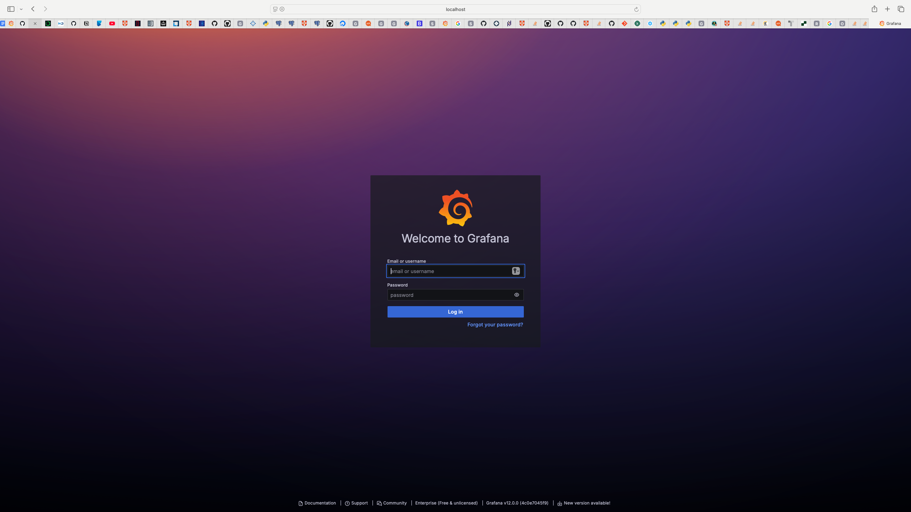
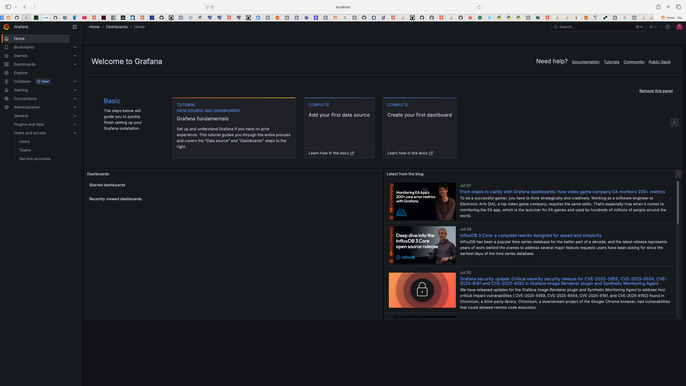
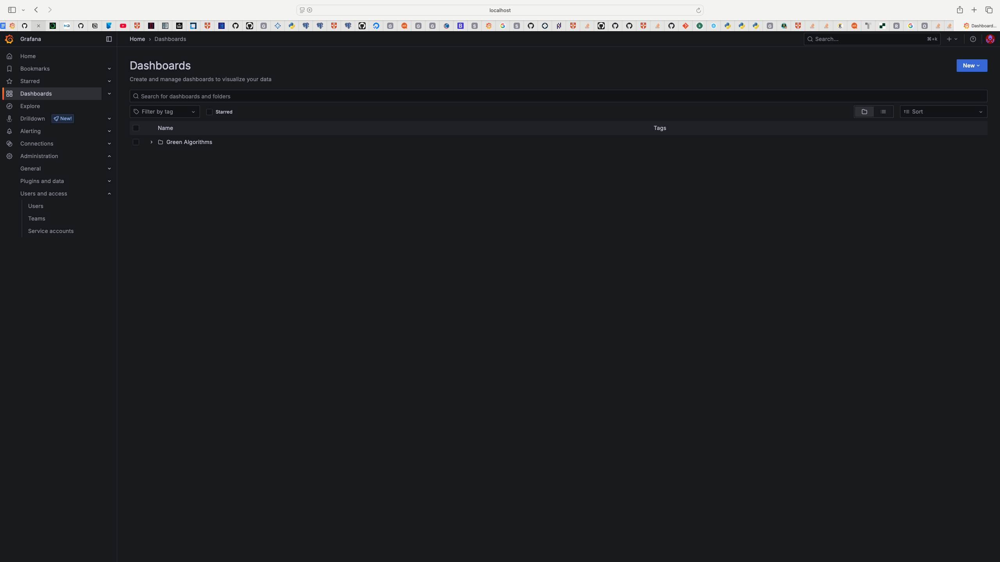
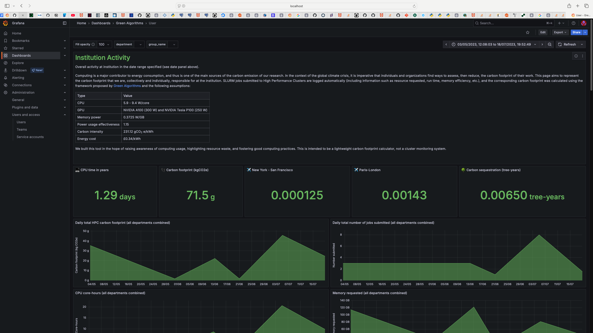

# GA4HPCDASHBOARD: Deployment notes

Repository used to setup the Green Algorithms dashboards, using [Grafana](https://grafana.com/) and a database. This allows you to examine HPC usage over time, with helpful graphs, charts, etc.

[Prerequisites](#prerequisites) - [Install `ga_dashboard`](#install-the-ga_dashboard-package) - [Configuration files](#configuration-files) - [Database](#database---postgresql) - [HPC users file](#hpc-users-file) - [Backend data](#backend-data) - [Dashboard platform](#dashboard-platform---grafana) - [Grafana users file](#generate-a-grafana-users-file---csv-format) - [Setup Green Algorithms dashboards](#setup-green-algorithms-dashboards) - [Frontend scripts](#run-frontend-scripts) - [Logging in to Grafana](#log-in-as-a-grafana-user)

The system uses:
* A PostgreSQL database.
* A backend, which obtains usage data from the HPC system (using the `sacct` command), aggregates it (to one row per user per day), enriches it (adds carbon footprint data), and then writes this to the database.
* A frontend, which uses Grafana to query the database and display nice charts.

Files required for the example instructions below (you can, of course, use your own):

* Wrapper script config file: `sample_config.txt`  (in `scripts/`)
* [Cluster config file](#configuration-files): `cluster_info.yaml` (in `ga_dashboard/samples/`)
* [HPC users for DB](#hpc-users-file): `hpc_users_list.csv` (in `ga_dashboard/samples/`)
* [Grafana user file](#generate-a-grafana-users-file---csv-format): `grafana_users_list.csv` (in `ga_dashboard/samples/`)
* [Fixed parameters file](#configuration-files). Example: `ga_dashboard/data/fixed_parameters.yaml`

Plus some anonymised log/data files, described in the [Backend data section](#backend-data).

There are a number of scripts you can use to set up the system with default values. You can either use these directly, or (recommended) use the wrapper script `scripts/run.py`, in which case you will need to ensure the values in `scripts/sample_config.txt` (or another config file of your choice) are what you want. 

Note that the passwords for Grafana and the PostgreSQL database are NOT stored in any config file, but must be entered at the command-line when required. When using the wrapper script, these passwords will not be echoed to the screen. At the present time the underlying scripts do not obscure the passwords when typed. (NB When the wrapper script calls one of the underlying scripts, you will NOT see the passwords.) When using the wrapper script, the only time you will see passwords is when they are generated (for you to note or otherwise take action) for Grafana users.

All the Python scripts allow you to specify a `--help` option to see the available options. Many of them have examples in the comments.

```
$ python scripts/run.py --help
usage: run.py [-h] [--config CONFIG_FILE]

User-friendly interface to the different scripts.

options:
  -h, --help            show this help message and exit
  --config CONFIG_FILE  Name of config file for your parameter values.

Uses sample config file by default.
```
The wrapper script calls the individual scripts under the hood.

```
$ python scripts/run.py

Using config file scripts/sample_config.txt
Select option:
[q] Exit.
[1] Import HPC users into database.
[2] Import already-aggregated, mock-up data into database.
[3] Create or overwrite database.
[4] Create a data source in Grafana for dashboard to connect to.
[5] Import dashboard(s) into a Grafana folder.
[6] Generate user passwords, import users to Grafana, and set their folder permissions.
[7] Do [4], [5] and [6] in one go (invokes run_dashboard.py).
[8] Run sacct command, and generate logfile, ON YOUR HPC SYSTEM.
[9] Run backend ON YOUR HPC SYSTEM (run sacct, enrich data with carbon footprint info, and add it to database).
> 
```


But you will need to set a few things up first, however you use the scripts.


[Documentation contents](./docs/Contents.md)

[More info on scripts](./scripts/RunningScripts.md)

## Prerequisites

You will probably want to set up an environment for your Python distribution. We used miniforge Go to the [download link](https://conda-forge.org/download/) and follow the instructions for your platform. You may need to look at the instructions on their [GitHub repository](https://github.com/conda-forge/miniforge).

Then, once installed, you can create an environment for a suitable version of python. For example:
```
$ conda create -n py313 python=3.13 -c conda-forge
$ conda activate py313
```
To leave the environment, type:
```
$ conda deactivate
```
To see your list of environments, type:
```
$ conda env list
```

## Install the `ga_dashboard` package
We assume you have `git` installed on your system. 

(In my case, I was working on a Mac. First, I had to install [`brew`](https://brew.sh/). And install the Xcode command-line tools. Then I was able to install `git`.)

In the top-level directory of the `GA4HPCdashboard` directory (i.e. one level above the `ga_dashboard` directory), type:
```
$ python -m pip install .
```
This should install the `ga_dashboard` package on your local machine. if you want to be able to 
edit it and still use it, use the `-e` option:
```
$ python -m pip install -e .
```

### Configuration files
A number of config files are required by the system, e.g., to calculate the carbon footprint. As well as a list of users for the database, and another list for Grafana, the system needs:

* Information about your HPC cluster. Example: `ga_dashboard/samples/cluster_info.yaml`
* Fixed parameters file. Example: `ga_dashboard/data/fixed_parameters.yaml`
* If you want to use the wrapper script, either use your own config file, or amend the sample one as required.


### Database - PostgreSQL

- Install PostgreSQL locally or have access to a PostgreSQL server

For Macs, we have used the relevant [Enterprise DB installer](https://www.enterprisedb.com/downloads/postgres-postgresql-downloads) to start with. Follow the instructions for your system.

Later, it may be necessary to get a version of Postgres for your platform which supports ssh. This
may require compiling Postgres yourself with the appropriate options. However, this is not
needed for the simple demo. 

Choose a username and password for the admin user. The former is usually `postgres` (although you can choose what you want). Do not record the password in a file! (In these instructions, we assume that the admin user name is `postgres`.)

Check that your `$PATH` allows you to access the PostgreSQL `psql` utility program.

You can then create the database by using option 3 of the wrapper script, or the `scripts/database/create_or_overwrite_database.py` script which it calls. The default database name is `ga_db`. 

> [!WARNING]  
> **NOTE THAT THIS WILL DELETE ANY EXISTING INSTANCE OF THE DATABASE!!!** As this is a dangerous operation, you will be prompted to confirm before proceeding with deletion and re-creation.

> [!WARNING]  
> **NOTE:** Ensure all connections to the database are closed before you do this, otherwise the script will fail. In particular, if you have started the Grafana server (as detailed further down this page), it may have a database connection, in which case you must stop the server (e.g. using CTRL-C).

### HPC users file
You will need a file with details of your HPC users for whom you are obtaining `sacct` data. For example, `ga_dashboard/samples/hpc_users_list.csv`. Or one like this:

```
User,UID,Name,Group,Department
tg1,11111,Thomas Greene,group 1,Dept 3
am1,22222,Adam Mackay,group 1,Dept 3
...
```

Displayed as a table:
| User| UID | Name           |  Group | Department |
| ----|---- | --------- | --------------- | ---------- |
| tg1 | 11111 | Thomas Greene |  group 1    | Dept 3 |
| am1 | 22222 | Adam Mackay| group 1| Dept 3 |
| ... | ...   | ... | ... |  ...       |


DO NOT STORE PASSWORDS IN THIS FILE!

You can import the listed users into the database by using option 1 of the wrapper script, and setting the value of `hpc_users_file` in the config file to what you want (unless you use `ga_dashboard/samples/hpc_users_list.csv`, in which case it will pick this up by default). Or, you can use the script `scripts/database/add_users_to_database.py` directly, although you will have to do a lot of typing if you choose to do so!

### Backend data
The dashboard extracts usage information from the HPC system. 

You need to make sure you have a list of HPC users in the database (see previous section).

Normally, you will run the `sacct` command on the HPC, using either the wrapper script `run.py`, or the scripts in `scripts/backend/`. But, to try out the software without getting logging information from your HPC system, you can use some samples we provide. 

Three (anonymised) examples of files you can use are:

* `ga_dashboard/samples/sacct_output_single_user.txt`
* `ga_dashboard/samples/sacct_output_multi_user.txt`
* `ga_dashboard/samples/userDaily_mockMultiUsers_1.csv`

The first file is an example of output generated, for one user, by the `sacct` command on the HPC system. This can be used if you want/need to 
import data into the database for testing, or if (say) you cannot get data from the HPC system. The second file is similar, but for multiple users. With both of these files, the backend part of the software will aggregate the data into one row per user per day, enrich it (add carbon footprint data), and then write this to the database. 

In order to do this, you can either execute the relevant script directly:

```
$ python scripts/backend/run_backend.py --useCustomLogs ga_dashboard/samples/sacct_output_multi_user.txt --db_password <password>
```

Or, use the wrapper script option 9, and set the `useCustomLogs` option in the wrapper config file to the file you want. (In normal operation, in which we query the HPC by running `sacct`, this option should be commented-out in the config file.)

The third file can be imported directly into the database, as it has already been aggregated and enriched. You can use option 2 of the wrapper script `run.py` to do this.

Of course, you don't have to use our sample files; you can get your own from your HPC system. Normally, you will either use option 8 or 9. Both options will run the `sacct` command. Option 9 will aggregate the data into one row per user per day, and enrich it with carbon footprint information, and write it to the database. That assumes your HPC node running the script can connect to your database. The alternative is to run option 8, which will save the output of the `sacct` command to a log file, which you can then download to a local machine, then load into the database using option 9 and the appropriate value for the `useCustomLogs` option in the wrapper config file, as described above. 

NB In order to run the `sacct` command, the scripts will need to run on the HPC system. Other than that, you can run them on your local machine.

### Dashboard platform - Grafana

Install the self-managed installation (Enterprise, just in case we want to host it on the cloud): [https://grafana.com/grafana/download?pg=get&plcmt=selfmanaged-box1-cta1](https://grafana.com/grafana/download?pg=get&plcmt=selfmanaged-box1-cta1)

### Generate a Grafana users file - csv format

The Grafana users file should be a comma-separated file combining these columns:
* **Name**: Full user name (e.g. Thomas Greene)
* **User name**: Company/Institute user name (e.g. tg1)
* **Email**: Company/Institute user email (e.g. tg1@ga-test.com)
* **Team name**: Name of the user team/department/unit (e.g. Team 1)

Example of input file format (CSV format with header):
```
Name,User name,Email,Team name
Thomas Greene,tg1,tg1@ga-test.com,Team 1
Adam Mackay,am1,am1@ga-test.com,Team 2
...
```
Displayed as a table:
| Name          | User name | Email           |  Team name |
| ------------- | --------- | --------------- | ---------- |
| Thomas Greene | tg1       | tg1@ga-test.com |  Team 1    |
| Adam Mackay   | am1       | am1@ga-test.com |  Team 2    |
| ...           | ...       | ...             |  ...       |

In this example, we have the same list of users for both the HPC system and Grafana. But you may have some who are on one list only, e.g., a manager might want to have access to the Grafana dashboard, but not the HPC system.


Note that, for security reasons, passwords are not stored in this file. Passwords will be automatically generated (to be noted, or acted on by your setup in some other way) when users are added to the Grafana Dashboard by option 6 of the wrapper script (or by using the `import_users.py` script).

An example you can use to try out the system is `ga_dashboard/samples/grafana_users_list.csv`

The passwords generated by this process adhere to [Grafana password policy](https://grafana.com/docs/grafana/next/setup-grafana/configure-security/configure-authentication/grafana/#strong-password-policy), if you decide to enforce it.

## Setup Green Algorithms dashboards


### Start Grafana

By default, Grafana displays dates in US format. If you'd like them in your local date format, run this command (or put it in your shell config):
```
$ export GF_DATE_FORMATS_USE_BROWSER_LOCALE=true
```

In the same shell, `cd` to the Grafana directory and start the server:

```
$ cd /.../grafana/
$ ./bin/grafana server
```

Depending on your system, you may not be able to do this. For example, on Linux, I had to use these steps to run the Grafana server after installation:

```
$ sudo bin/systemctl daemon-reload
$ sudo bin/systemctl enable grafana-server
$ sudo bin/systemctl start grafana-server
```

### To stop the Grafana server
In the former case above, you can just CTRL-C the server. In the latter, you might have to do:

```
$ sudo bin/systemctl stop grafana-server
```

the `systemctl` command might be elsewhere on a Linux system, e.g., `/usr/bin/systemctl`.

Once you have started Grafana on your system, log in as admin on the web browser (admin:admin): [http://localhost:3000/](http://localhost:3000/).  


### Run frontend script(s)

Once Grafana is started, you will want to undertake a number of actions. You can use different options of the wrapper script to do these. To do everything in one go, choose option 7, or use the script `scripts/frontend/run_dashboard.py`. This will:

* Create the data source
* Create the dashboards folder
* Import the dashboards
* Create users and teams
* Set the permissions on the folder

There is a lot of typing if you don't use the wrapper script (and amended config file), but use the underlying script directly instead.

For instance:
```
$ python run_dashboard.py \
  --admin_login admin --admin_password <adm_password> \
  --db_name ga_db --db_user <db_user_name> --db_password <db_user_password> --pg_version 15 \
  --input_file <path_to_users_csv_file>
```

Using the default options, and default password for Grafana admin:
```
$ python scripts/frontend/run_dashboard.py --admin_password admin --db_password <password>
```

Options are:
```
  --name DS_NAME: Data source name | default: grafana-postgresql-ga_db
  --url URL: Grafana URL | default: localhost:3000
  --admin_login ADMIN_NAME: Grafana admin name | default: admin
  --admin_password ADMIN_PASS: Grafana admin password
  --db_name DB_NAME: Database name
  --db_user DB_USER: Database user name
  --db_password DB_PASSWORD: Database user password
  --db_host DB_HOST: Database host | default: localhost
  --db_port DB_PORT: Database port | default: 5432
  --pg_version PG_VERSION: PostgreSQL version | default: 13
  --dashboard_folder_name DASHBOARD_FOLDER_NAME: Name of the dashboard folder | default: Green Algorithms
  --input_dir INPUT_DIR: Dashboard files directory
  --input_file INPUT_FILE: User list in CSV format
```


### Log in as a Grafana user.
By default, only the administrator (default name: admin) is allowed to edit dashboards. Although you can allow other users to do so.

> [!IMPORTANT]  
> You should change the admin password to something else, to reduce the likelihood of being hacked.

In the following, you can click on the screenshots to enlarge them.

Let's assume you want to log in as a basic user (not an admin). If you point your browser to port 3000, you should see something like this, if Grafana is running:



Assuming you now enter the login details for a user, you should see something like this:



Click on "Dashboards" in the menu at the left of the screen. A new screen should then load:



If you click the little arrow to the left of "Green Algorithms", you should see "User" listed. If you then clock on that, you should be taken to the User dashboard:



Note that the data you see will depend on (1) which data you loaded into the PostgreSQL database, and (2) the time range you select (which you can either do with the panel near the top-right of the dashboard, or by manually selecting a time range from one of the time series plots.)

For this to work, it assumes you have the PostgreSQL database set up as a "data source" in Grafana (see notes on scripts above).


