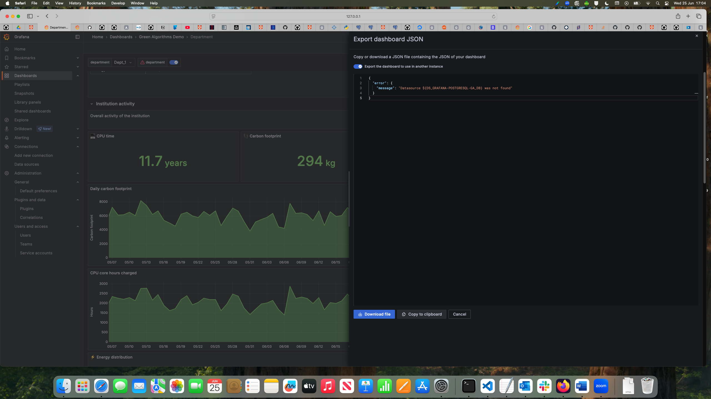

# Working around the Grafana export bug

Sometimes, when you want to export a Grafana dashboard so it can be used elsewhere, you might see the bug in the picture



If this happens, switch off "Export the dashboard to use in another instance", then copy the JSON there into a file.

Then make a backup copy of this file, in case you mess things up.

Next, insert the following into the JSON file:
```
"__inputs": [
    {
      "name": "DS_GRAFANA-POSTGRESQL-GA_DB",
      "label": "grafana-postgresql-ga_db",
      "description": "",
      "type": "datasource",
      "pluginId": "grafana-postgresql-datasource",
      "pluginName": "PostgreSQL"
    }
  ],
  ```
on the line immediately after the opening `{` charac ter at the top of the file.

Important: make sure the values for "name" and "label" match your set up.

If you look into your JSON file, you will see lines similar to this:

```
      "datasource": {
        "type": "grafana-postgresql-datasource",
        "uid": "deq10yw1aboqoe"
      },
```
Your `uid` will likely be different.
You now need to go through the JSON file and change all entries like that to this:
```
        "datasource": {
          "type": "grafana-postgresql-datasource",
          "uid": "${DS_GRAFANA-POSTGRESQL-GA_DB}"
        },
```
again, the `uid` must match yours, the one you just put into the top of the file.
When you have finished, delete the existing dashboard in Grafana, and import the one you have just made. You should find it loads OK, and that you can export it for other users.

You should stil have the backup copy you made above, in case you need to go through the process again, or you do but it doesn't work.

